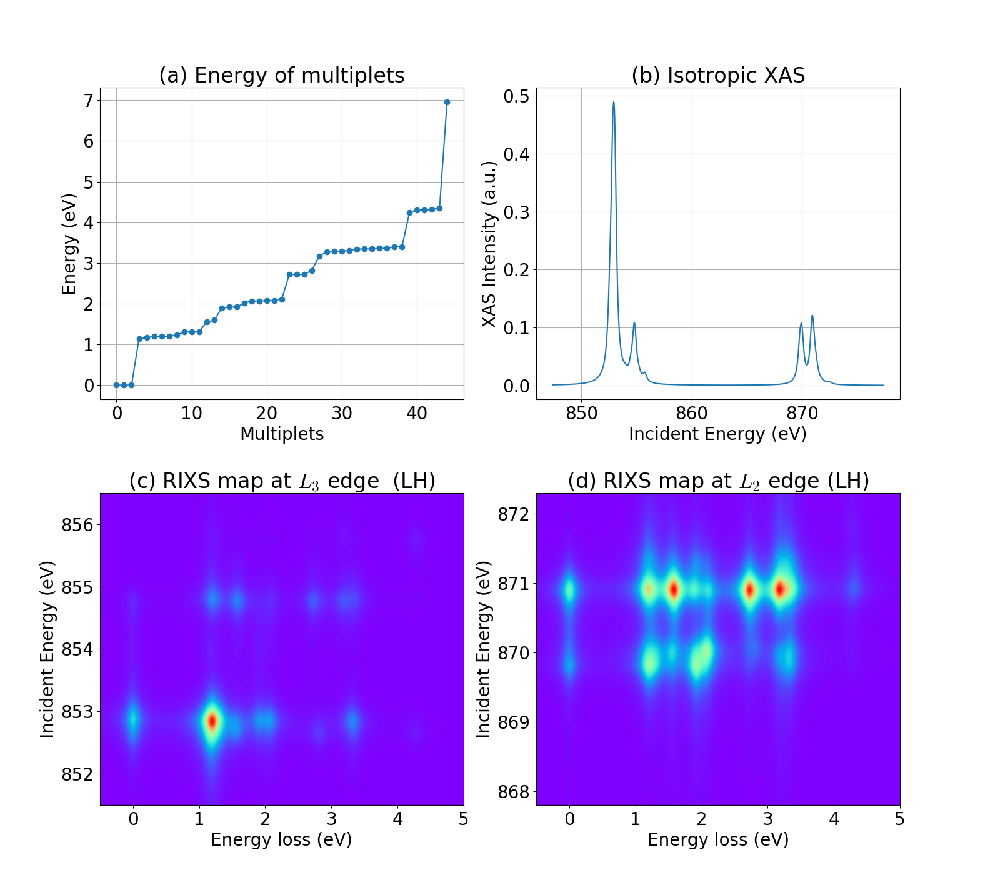

===================
Quickstart tutorial
===================

Hello RIXS!
-----------
This is a "Hello World!" example for RIXS simulations at Ni (:math:`3d^8`) :math:`L_{2/3}` edges.
:math:`L_3` means transition from Ni-:math:`2p_{3/2}` to Ni-:math:`3d`, and
:math:`L_2` means transition from Ni-:math:`2p_{1/2}` to Ni-:math:`3d`.

::

    #!/usr/bin/env python
    
    import numpy as np
    import matplotlib.pyplot as plt
    import matplotlib as mpl
    import edrixs
    
    # Setup parameters
    # ----------------
    # Slater integrals for 3d-3d interaction
    F2_dd, F4_dd = 12.234 * 0.65, 7.598 * 0.65
    F0_dd = edrixs.get_F0('d', F2_dd, F4_dd)
    
    # Slater integrals for 3d-2p interaction
    G1_dp, G3_dp = 5.787 * 0.7, 3.291 * 0.7
    F0_dp = edrixs.get_F0('dp', G1_dp, G3_dp)
    F2_dp = 7.721 * 0.95
    
    slater = ([F0_dd, F2_dd, F4_dd], [F0_dd, F2_dd, F4_dd, F0_dp, F2_dp, G1_dp, G3_dp])
    
    # Spin-orbit coupling strengths
    zeta_d_i = 0.083  # valence 3d electron without core-hole
    zeta_d_n = 0.102  # valence 3d electron with core-hole
    zeta_p_n = 11.24  # core 2p electron
    
    # Tetragonal crystal field
    cf = edrixs.cf_tetragonal_d(ten_dq=1.3, d1=0.05, d3=0.2)
    
    # Level shift of the core shell
    off = 857.4
    
    # Number of occupancy of 3d shell
    noccu = 8
    
    # Life time broadening
    gamma_c = 0.2  # core hole
    gamma_f = 0.1  # final states
    
    # Incident, scattered, azimuthal angles
    thin, thout, phi = 15 / 180.0 * np.pi, 75 / 180.0 * np.pi, 0.0
    
    # Polarization types
    poltype_xas = [('isotropic', 0.0)]  # for XAS
    poltype_rixs = [('linear', 0, 'linear', 0), ('linear', 0, 'linear', np.pi/2.0)]  # for RIXS
    
    # Energy grid
    ominc_xas = np.linspace(off - 10, off + 20, 1000)  # for XAS
    ominc_rixs_L3 = np.linspace(-5.9 + off, -0.9 + off, 100)  # incident energy at L3 edge
    ominc_rixs_L2 = np.linspace(10.4 + off, 14.9 + off, 100)  # incident energy at L3 edge
    eloss = np.linspace(-0.5, 5.0, 1000)  # energy loss for RIXS
    
    # Run ED
    result = edrixs.ed_1v1c(v_name='d', c_name='p', v_soc=(zeta_d_i, zeta_d_n), c_soc=zeta_p_n,
                            c_level=-off, v_noccu=noccu, slater=slater, cf_mat=cf)
    eval_i, eval_n, trans_op = result
    
    # Run XAS
    xas = edrixs.xas_1v1c(eval_i, eval_n, trans_op, ominc_xas, gamma_c, thin, phi,
                          poltype=poltype_xas, gs_list=[0, 1, 2], temperature=300)
    
    # Run RIXS at L3 edge
    rixs_L3 = edrixs.rixs_1v1c(eval_i, eval_n, trans_op, ominc_rixs_L3, eloss, gamma_c, gamma_f,
                               thin, thout, phi, poltype=poltype_rixs,
                               gs_list=[0, 1, 2], temperature=300)
    
    # Run RIXS at L2 edge
    rixs_L2 = edrixs.rixs_1v1c(eval_i, eval_n, trans_op, ominc_rixs_L2, eloss, gamma_c, gamma_f,
                               thin, thout, phi, poltype=poltype_rixs,
                               gs_list=[0, 1, 2], temperature=300)
    

